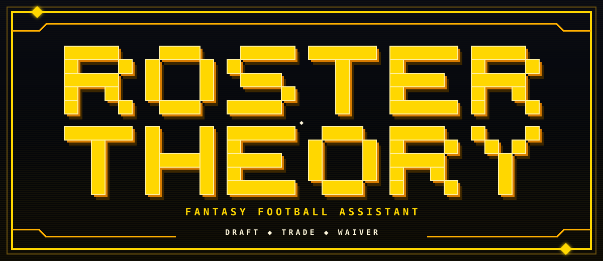

# RosterTheory



A command-line fantasy football assistant for Sleeper leagues.

RosterTheory helps with drafts, trades, and waivers. It reads your league's
settings and combines them with FantasyPros rankings and projections to give
you league-specific advice.

It never makes a pick, sends a trade, submits a waiver claim, or changes your
lineup. It only shows recommendations. You decide what to do with them.

## What it does

- **Draft:** builds a draft board, compares strategies, and follows live
  Sleeper drafts and mocks.
- **Trade:** reviews your roster, evaluates proposed trades, and searches for
  deals that could help both teams.
- **Waiver:** evaluates add/drop ideas and searches the available player pool.

RosterTheory does not guess when important information is missing. If your
rankings are stale, a player cannot be matched, or your league needs its own
decision rules, the command will explain what is missing and how to fix it.

## What you need

- Python 3.11 or newer
- A Sleeper league
- A FantasyPros HOF Premium API key for automatic rankings and projections

Sleeper's public data does not require a key. You can also use the help and
setup-checking commands without a FantasyPros key.

## Install

RosterTheory is installed directly from GitHub:

```powershell
git clone https://github.com/jaret81/RosterTheory.git
cd RosterTheory
python -m venv .venv
./.venv/Scripts/Activate.ps1
python -m pip install .
```

On macOS or Linux, activate the environment with:

```bash
source .venv/bin/activate
```

Run the built-in guide to see the main commands:

```text
roster-theory help
```

## Set up a league

The setup commands create the private configuration files for you. Replace the
example values below with your Sleeper information:

```powershell
roster-theory setup init

roster-theory setup owner `
  --sleeper-username YOUR_NAME `
  --sleeper-user-id YOUR_USER_ID `
  --update

roster-theory setup add-league home_league `
  --season 2026 `
  --name "Home League" `
  --league-id YOUR_LEAGUE_ID `
  --user-roster-id 1 `
  --draft-id YOUR_DRAFT_ID `
  --user-draft-slot 1 `
  --update

roster-theory setup scaffold home_league --update-config
roster-theory doctor home_league
```

`home_league` is a nickname used only in your commands. You can choose a
different name.

Your private configuration is stored in your normal user configuration folder:

- Windows: `%APPDATA%\RosterTheory\leagues.json`
- macOS and Linux: `~/.config/roster-theory/leagues.json`, unless
  `$XDG_CONFIG_HOME` is set

You can use a different file by putting `--config PATH` before the command or
by setting `ROSTER_THEORY_CONFIG`.

The generated decision-policy files start as uncalibrated. That is intentional:
rules that work for one league should not silently be reused in another.
`roster-theory doctor home_league` will show what still needs attention.

## Add your FantasyPros key

Set the key in your terminal session. Do not paste it into a tracked file.

PowerShell:

```powershell
$env:FANTASYPROS_API_KEY = "YOUR_KEY"
```

macOS or Linux:

```bash
export FANTASYPROS_API_KEY="YOUR_KEY"
```

If your FantasyPros plan does not provide the data an assistant needs, you can
import an authorized CSV instead. See the
[manual import guide](docs/MANUAL_FANTASYPROS_IMPORT.md).

## Prepare the data

This is the normal command to run before using an assistant:

```text
roster-theory inputs prepare home_league --assistant all
```

It reuses fresh data, refreshes anything missing or stale, and tells you about
anything that still needs a decision from you. To check without refreshing:

```text
roster-theory inputs status home_league --assistant all
roster-theory doctor home_league
```

Use `draft`, `trade`, or `waiver` instead of `all` when you only want to prepare
one assistant.

## Draft

Build your league's draft board:

```text
roster-theory inputs prepare home_league --assistant draft
roster-theory fantasypros-league-boards --league home_league
```

The board command prints the path it created. Use that path to get a single
recommendation:

```text
roster-theory recommend home_league --board PATH_TO_BOARD --slot 1
```

Or follow a live Sleeper draft or mock:

```text
roster-theory watch-mock SLEEPER_DRAFT_URL --league home_league --board PATH_TO_BOARD --slot 1 --user-id YOUR_USER_ID
```

## Trade

Prepare the current data, review your roster, or search for ideas:

```text
roster-theory inputs prepare home_league --assistant trade
roster-theory trade diagnose home_league
roster-theory trade search home_league
```

To evaluate a trade you already have in mind:

```text
roster-theory trade evaluate home_league --send "Player A" --receive "Player B"
```

Repeat `--send` or `--receive` for multi-player trades.

## Waiver

Build a fresh waiver input file, then use the path printed by that command:

```text
roster-theory inputs prepare home_league --assistant waiver
roster-theory waiver inputs home_league
roster-theory waiver search home_league --inputs PATH_TO_INPUTS
```

To evaluate one move:

```text
roster-theory waiver evaluate home_league --add "Player A" --drop "Player B" --inputs PATH_TO_INPUTS
```

## Finding commands

Start with:

```text
roster-theory help
```

Every command also has its own help:

```text
roster-theory --help
roster-theory trade --help
roster-theory trade evaluate --help
roster-theory waiver --help
roster-theory inputs --help
```

Add `--json` to supported commands when another program needs to read the
result. Add `--no-banner` before a command if you do not want terminal artwork.

## Privacy

Keep real league IDs, provider responses, exports, and manual inputs out of
Git. RosterTheory's default private-data folders are ignored by this repository,
and setup commands can show a redacted version of your configuration:

```text
roster-theory setup show-redacted home_league
```

Public examples contain invented data. See [Privacy](docs/PRIVACY.md) and
[third-party data notices](docs/THIRD_PARTY_NOTICES.md) for details.

## Development

Install the development tools and run the tests:

```powershell
python -m pip install -e ".[dev]"
$env:PYTHONPATH = "src"
python -m unittest discover -s tests
```

See [Contributing](CONTRIBUTING.md) for the rest of the contributor workflow.

## License

RosterTheory is released under [the Unlicense](LICENSE). You may use, copy,
change, distribute, or sell it for any purpose. It comes without a warranty.
